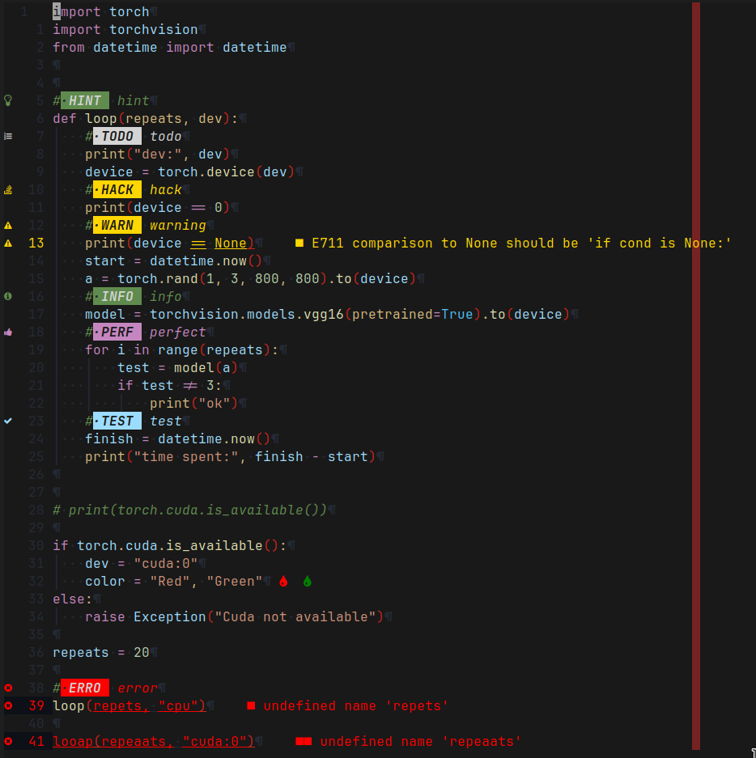

# Vim TCCS



Tiyns custom color scheme (TCCS) for vim is an adaption of
[Mofiquls vscode.nvim](https://github.com/Mofiqul/vscode.nvim) which is based upon colors from
[tomasisers vim-code-dark](https://github.com/tomasiser/vim-code-dark).
The colors were changed and differ from the original quite a bit.
Additionally the support for multiple different flavors was removed.
This color scheme is available only in dark mode.

This color scheme uses colors that match the ones of VSCode with strong red and
yellow colors for errors and warnings.
Additionally a darker background was added for better contrast.

## Supported Plugins

Following Plugins are especially supported by this color scheme.
Other plugins may work as well, but don't are explicitly configured.

- [Lualine](https://github.com/nvim-lualine/lualine.nvim)

## Setup

This section supposes [Lazy.nvim](https://github.com/folke/lazy.nvim) is used.
Other plugin managers can be used too - the setup has to be adapted accordingly then.

Add the following line into the function `return require("lazy").setup({})` to load the plugin.

```lua
{
  'tiyn/tccs.nvim',
  config = function()
    require('tccs').setup()
    vim.cmd('colorscheme tccs')
  end
},
```

For LuaLine support add the following lines in in the same way of the previous code block.

```lua
{
    'nvim-lualine/lualine.nvim',
    dependencies = {
        'nvim-tree/nvim-web-devicons',
        'tiyn/tccs.nvim',
    },
    opts = {
        options = {
          theme = 'tccs',
        },
    },
}
```

### Options

```lua
-- Enable transparent background
transparent = true,

-- Enable italic comment
italic_comments = true,

-- Disable nvim-tree background color
disable_nvimtree_bg = true,

-- Override colors (see ./lua/vscode/colors.lua)
color_overrides = {
    vscLineNumber = '#FFFFFF',
},

-- Override highlight groups (see ./lua/vscode/theme.lua)
group_overrides = {
    -- this supports the same val table as vim.api.nvim_set_hl
    -- use colors from this color scheme by requiring vscode.colors!
    Cursor = { fg=c.vscDarkBlue, bg=c.vscLightGreen, bold=true },
}
```
